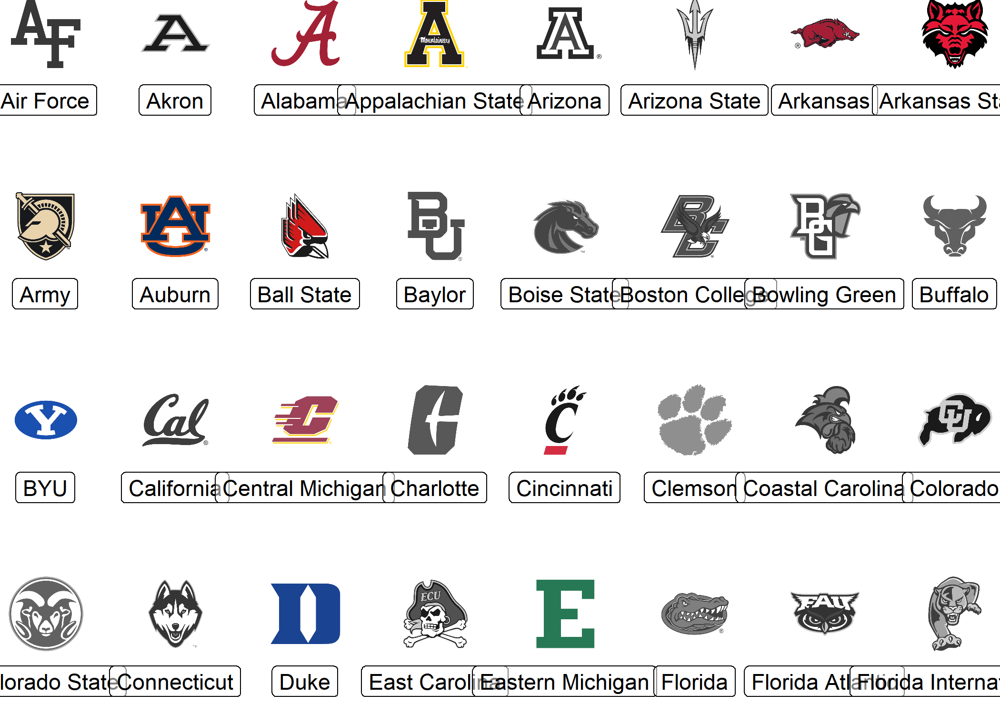

<!-- README.md is generated from README.Rmd. Please edit that file -->

# cfbplotR <a href='https://cfbplotR.sportsdataverse.org/'></a>

<!-- badges: start -->
<!-- [](https://CRAN.R-project.org/package=cfbplotR) -->

[](https://github.com/sportsdataverse/cfbplotR/)
[](https://github.com/sportsdataverse/cfbplotR/actions/workflows/R-CMD-check.yaml)
[](https://lifecycle.r-lib.org/articles/stages.html#experimental)[](https://github.com/sportsdataverse/cfbplotR/graphs/contributors)
[](https://twitter.com/JaredDLee)
[](https://twitter.com/SportsDataverse)
<!-- [](https://github.com/Kazink36/cfbplotR/actions) -->
<!-- [](https://github.com/Kazink36/cfbplotR/actions)-->
<!-- badges: end -->

The code for this package was copied heavily from
[nflplotR](https://nflplotr.nflverse.com/index.html) with minor changes
to support college football team logos.

The goal of `cfbplotR` is to provide functions and geoms that help
visualization of CFB related analysis. It provides a ggplot2 geom that
does the heavy lifting of plotting CFB logos in high quality, with
correct aspect ratio and possible transparency.

## Installation

<!-- You can install the released version of cfbplotR from [CRAN](https://CRAN.R-project.org) with: -->
<!-- ``` r -->
<!-- install.packages("cfbplotR") -->
<!-- ``` -->
<!-- And the development version from [GitHub](https://github.com/) with: -->
<!-- ``` r -->
<!-- # install.packages("devtools") -->
<!-- devtools::install_github("Kazink36/cfbplotR") -->
<!-- ``` -->

You can install the development version from
[GitHub](https://github.com/) with:

``` r
if (!require("remotes")) install.packages("remotes")
remotes::install_github("sportsdataverse/cfbplotR")
```

## Using cfbplotR

[You can follow this tutorial to see several different uses for
`cfbplotR`.](https://cfbplotR.sportsdataverse.org/articles/tutorial.html)
The key function in the package is `geom_cfb_logo()` which will add
college football team logos to a ggplot.

``` r
library(cfbplotR)
library(ggplot2)
team <- valid_team_names()
team <- team[1:32]
df <- data.frame(
  a = rep(1:8, 4),
  b = sort(rep(1:4, 8), decreasing = TRUE),
  teams = team
)

# keep alpha == 1 for all teams including an "A"
matches <- grepl("A", team)
df$alpha <- ifelse(matches, 1, 0.9)
# change color of all teams including an "o" to black and white
matches <- grepl("o", team)
df$color <- ifelse(matches, "b/w", NA)

 ggplot(df, aes(x = a, y = b)) +
   geom_cfb_logos(aes(team = teams, color = color, alpha = alpha), width = 0.075) +
   geom_label(aes(label = teams), nudge_y = -0.35, alpha = 0.5) +
   scale_color_identity() +
   scale_alpha_identity() +
   theme_void() 
```



## Getting help

The best places to get help on this package are:

- messaging [Jared Lee on twitter](https://twitter.com/JaredDLee)
- opening [an
  issue](https://github.com/sportsdataverse/cfbplotR/issues/new/choose)

## Contributing

Many hands make light work! Here are some ways you can contribute to
this project:

- You can [open an
  issue](https://github.com/sportsdataverse/cfbplotR/issues/new/choose)
  if you’d like to request specific data or report a bug/error.

## Terms of Use

The R code for this package is released as open source under the [MIT
License](https://cfbplotR.sportsdataverse.org/LICENSE.html). CFB data
accessed by this package belong to their respective owners, and are
governed by their terms of use.

## Follow [cfbfastR](https://twitter.com/cfbfastR) and the [SportsDataverse](https://twitter.com/SportsDataverse) on Twitter and star this repo

[](https://twitter.com/cfbfastR)

[](https://twitter.com/SportsDataverse)

[](https://github.com/sportsdataverse/cfbplotR/stargazers/)

## **Our Authors**

- [Jared Lee](https://twitter.com/JaredDLee) </br>
  <a href="https://twitter.com/JaredDLee" target="blank"></a>
  <a href="https://github.com/Kazink36" target="blank"></a>

- [Sebastian Carl](https://twitter.com/mrcaseb)  
  <a href="https://twitter.com/mrcaseb" target="blank"></a>
  <a href="https://github.com/mrcaseb" target="blank"></a>

## **Our Contributors (they’re awesome)**

- [Saiem Gilani](https://twitter.com/saiemgilani)  
  <a href="https://twitter.com/saiemgilani" target="blank"></a>
  <a href="https://github.com/saiemgilani" target="blank"></a>

## **Citations**

To cite the [**`cfbplotR`**](https://cfbplotR.sportsdataverse.org/) R
package in publications, use:

BibTex Citation

``` bibtex
@misc{lee_carl_2021_cfbplotr,
  author = {Jared Lee and Sebastian Carl},
  title = {cfbplotR: The SportsDataverse's R Package for College Football Plotting.},
  url = {https://cfbplotR.sportsdataverse.org/},
  year = {2021}
}
```
