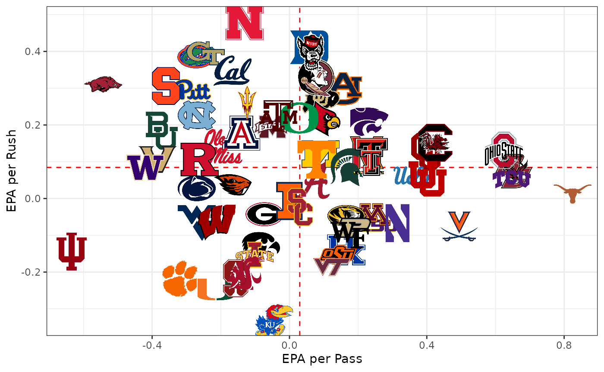
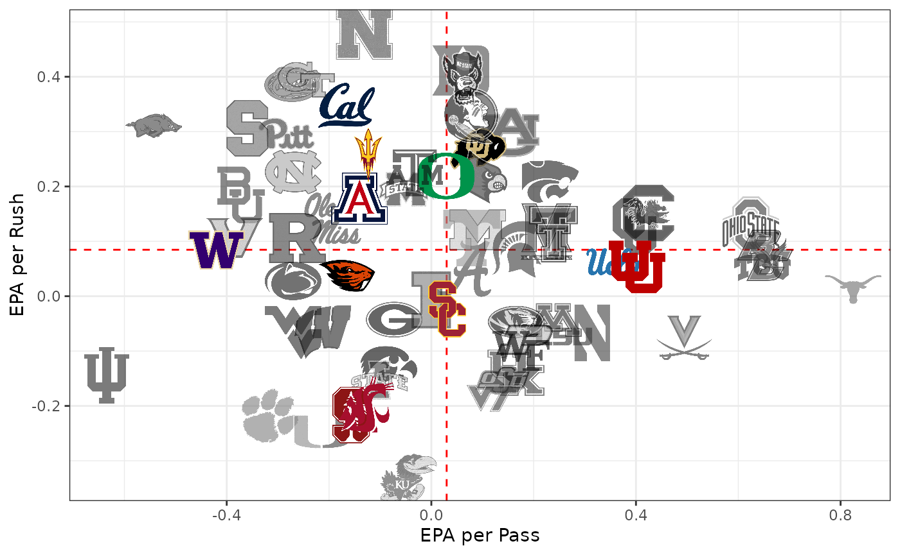
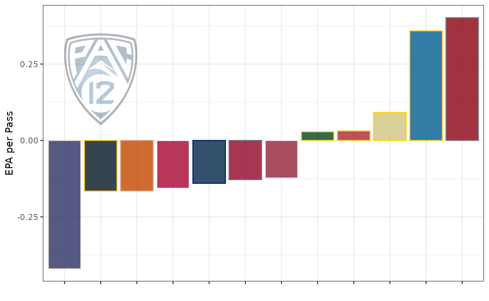
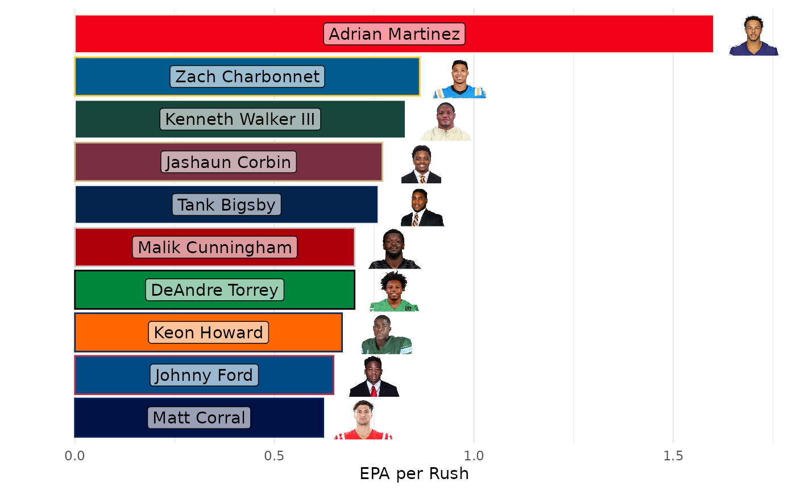

# Using cfbplotR

This is a quick tutorial on how to use cfbplotR to quickly and easily
include college football team logos in your ggplot.

## Load and Process Data

First we need to load the necessary libraries.
[`cfbfastR`](https://cfbfastR.sportsdataverse.org/) will get us the data
we want to use for analysis.
[`cfbplotR`](https://cfbplotR.sportsdataverse.org/) will help us easily
plot the results. `tidyverse` will help us do the necessary data
manipulation and of course includes `ggplot2` that we will use for
plotting. You can use the commented out code to install these packages
if you don’t already have them.

``` r

#remotes::install_github(repo = "sportsdataverse/cfbfastR")
#remotes::install_github(repo = "sportsdataverse/cfbplotR")
#install.packages(tidyverse)

library(cfbfastR)
library(cfbplotR)
library(dplyr, warn.conflicts = FALSE)
library(ggplot2)
library(tidyr)
library(forcats)
```

This first chunk of code will pull the play-by-play data from the first
week of the 2021 season using the `cfbfastR` data repo and create the
advanced metrics like EPA that we will be plotting (this will take a
second). We’ll also pull in the general team info so we can filter down
to just teams in a power 5 conference.

``` r

pbp <- cfbfastR::load_cfb_pbp(2021) %>% 
  filter(week == 1)

team_info <- cfbfastR::cfbd_team_info(year = 2021)
team_info <- team_info %>% 
  dplyr::select("team" = "school", "conference", "mascot") %>% 
  dplyr::filter(conference %in% c("Pac-12","ACC","SEC","Big Ten","Big 12"))
```

Now we quickly roll up the EPA data and find the EPA per rush and EPA
per pass for every team in week 1 and take a look at our plotting data.

``` r

team_plot_data <- pbp %>% 
  dplyr::group_by(team = offense_play) %>% 
  dplyr::summarize(rush_epa = mean(if_else(rush == 1,EPA,NA_real_),na.rm = TRUE),
            n_rush = sum(rush),
            pass_epa = mean(if_else(pass == 1,EPA,NA_real_),na.rm = TRUE),
            n_pass = sum(pass)) %>% 
  dplyr::filter(team %in% team_info$team) %>% 
  dplyr::left_join(team_info,by = "team")

head(team_plot_data)
```

    ## # A tibble: 6 × 7
    ##   team          rush_epa n_rush pass_epa n_pass conference mascot      
    ##   <chr>            <dbl>  <dbl>    <dbl>  <dbl> <chr>      <chr>       
    ## 1 Alabama         0.0502    105   0.0589    131 SEC        Crimson Tide
    ## 2 Arizona         0.178      31  -0.140      53 Pac-12     Wildcats    
    ## 3 Arizona State   0.256      65  -0.123      46 Pac-12     Sun Devils  
    ## 4 Arkansas        0.311      93  -0.543      48 SEC        Razorbacks  
    ## 5 Auburn          0.299      63   0.156      65 SEC        Tigers      
    ## 6 Baylor          0.185      86  -0.372      41 Big 12     Bears

## Plotting with cfbplotR

Now that the data is prepped, we can being to use `cfbplotR`. First
we’ll plot all the teams with Passing EPA on the x-axis and Rushing EPA
on the y-axis with lines showing the median value for each. It’s
important to set width or height in `geom_cfb_logos` to small values.
The default of 1 will create extremely large logos.

``` r

ggplot(team_plot_data, aes(x = pass_epa, y = rush_epa)) +
  geom_median_lines(aes(v_var = pass_epa, h_var = rush_epa)) +
  geom_cfb_logos(aes(team = team), width = 0.075) +
  labs(x = "EPA per Pass",y = "EPA per Rush") +
  theme_bw()
```

    ## Warning: Using the `size` aesthetic with geom_segment was deprecated in ggplot2 3.4.0.
    ## ℹ Please use the `linewidth` aesthetic instead.
    ## This warning is displayed once per session.
    ## Call `lifecycle::last_lifecycle_warnings()` to see where this warning was
    ## generated.



This is still pretty messy because of the large number of teams. Let’s
try to focus in on the Pac-12 teams with a couple of handy tools. We’re
going to add two columns to our data: one for the color and one for the
alpha. Then we just add those two columns as aesthetics to
`geom_cfb_logos` to turn the logos of non-Pac-12 teams black and white
and lower the alpha.

``` r

team_plot_data %>% 
  dplyr::mutate(color = if_else(conference == "Pac-12",NA_character_,"b/w"),
         alpha = if_else(conference == "Pac-12",1,.6)) %>% 
  ggplot(aes(x = pass_epa, y = rush_epa)) +
  geom_median_lines(aes(v_var = pass_epa, h_var = rush_epa)) +
  geom_cfb_logos(aes(team = team, alpha = alpha, color = color), width = 0.075) +
  scale_alpha_identity() +
  scale_color_identity() +
  labs(x = "EPA per Pass",y = "EPA per Rush") +
  theme_bw()
```



Finally let’s make a bar chart showing the Pac-12 EPA per pass for each
team. Because `cfbplotR` creates a custom geom for ggplot, we can use
[`annotate()`](https://ggplot2.tidyverse.org/reference/annotate.html) to
place a log anywhere we’d like.
[`scale_color_cfb()`](https://cfbplotr.sportsdataverse.org/reference/scale_color_cfb.md)
and
[`scale_fill_cfb()`](https://cfbplotr.sportsdataverse.org/reference/scale_color_cfb.md)
let us automatically use a teams primary color on a plot. The
`alt_colors` argument lets us pass through a vector of team names that
we want to use an alternate color for. ~~`sacle_x_cfb()` and
[`scale_y_cfb()`](https://cfbplotr.sportsdataverse.org/reference/scale_axes_cfb.md)
change the axis labels that are team names into logos. Due to the way
ggplot works, you have to add the corresponding theme function
[`theme_x_cfb()`](https://cfbplotr.sportsdataverse.org/reference/theme_cfb.md)
or
[`theme_y_cfb()`](https://cfbplotr.sportsdataverse.org/reference/theme_cfb.md).~~
[`element_cfb_logo()`](https://cfbplotr.sportsdataverse.org/reference/element.md)
and
[`element_cfb_headshot()`](https://cfbplotr.sportsdataverse.org/reference/element.md)
can be used for the axis.text argument in the theme function for
improved performance in using logos and headshots as axis labels.

``` r

team_plot_data %>% 
  dplyr::filter(conference == "Pac-12") %>% 
  dplyr::mutate(team = fct_reorder(team,pass_epa)) %>% 
  ggplot(aes(x = team, y = pass_epa)) +
  # 
  geom_col(aes(fill = team, color = team),size = 1.5) +
  annotate(GeomCFBlogo,x = "California",y = 0.2,team = "Pac-12",height = .35,alpha = .3) +
  scale_fill_cfb(alpha = .8) +
  scale_color_cfb(alt_colors = team_plot_data$team) +
  #scale_x_cfb(size = 18) +
  labs(x = "", y = "EPA per Pass") +
  theme_bw() +
  #theme_x_cfb()
  theme(axis.text.x = element_cfb_logo())
```

    ## Warning in geom_col(aes(fill = team, color = team), size = 1.5):
    ## Ignoring unknown parameters: `size`



`cfbplotR` also allows you to plot player headshots. Let’s look at the
top 10 rushing EPA players with more than 10 rushes for week 1.

``` r

player_plot_data <- pbp %>% 
  dplyr::filter(!is.na(rush_player_id)) %>% 
  dplyr::group_by(rush_player_id) %>% 
  dplyr::summarize(epa = mean(EPA, na.rm = TRUE),
            player_name = first(rusher_player_name),
            team = first(pos_team),
            n = n()) %>% 
  dplyr::filter(n >= 10) %>% 
  dplyr::arrange(dplyr::desc(epa)) %>% 
  dplyr::slice(1:10)

player_plot_data %>% 
  dplyr::mutate(team_ordered = fct_reorder(team,epa)) %>% 
  ggplot(aes(y = team_ordered, x = epa)) +
  geom_col(aes(color = team, fill = team)) +
  geom_label(aes(label = player_name, x = epa / 2), alpha = .6) +
  geom_cfb_headshots(aes(player_id = rush_player_id, x = epa + .1), height = .1) +
  scale_color_cfb(alt_colors = valid_team_names()) +
  scale_fill_cfb() +
  labs(y = "", x = "EPA per Rush") +
  #scale_y_cfb(size = 18) +
  theme_minimal() +
  theme(legend.position = "none",
        panel.grid.major.y = element_blank()) +
  #theme_y_cfb()
  theme(axis.text.y = element_cfb_logo())
```



## Tables with cfbplotR

The `gt` package offers an easy way to create nice tables of data and
the `gtExtras` package from Tom Mock provides a number of convenient
functions for styling those tables. The
[`gt_fmt_cfb_logo()`](https://cfbplotr.sportsdataverse.org/reference/gt_cfb.md)
and
[`gt_fmt_cfb_wordmark()`](https://cfbplotr.sportsdataverse.org/reference/gt_cfb.md)
functions are slightly modified versions of `gtExtras::gt_image_rows()`
to easily add team and conference logos or wordmarks based on names from
[`valid_team_names()`](https://cfbplotr.sportsdataverse.org/reference/valid_team_names.md).
The
[`gt_merge_stack_team_color()`](https://cfbplotr.sportsdataverse.org/reference/gt_stack_team.md)
function is a slightly modified version of `gtExtras::gt_merge_stack()`
that merges two columns together and colors the text of the bottom row
with the color of the team referenced in a third column. We can quickly
make a table showing the top teams from week 1 by EPA per pass.

``` r

library(gt)

team_plot_data %>% 
  dplyr::transmute(.data$conference, 
            .data$team, 
            logo = team, 
            .data$mascot, 
            wordmark = team,
            pass_epa = round(pass_epa, 2),
            .data$n_pass, 
            rush_epa = round(rush_epa, 2),
            .data$n_rush) %>% 
  dplyr::arrange(desc(pass_epa)) %>% 
  head(8) %>% 
  gt() %>% 
  gt_fmt_cfb_logo(columns = c("conference","logo")) %>% 
  gt_fmt_cfb_wordmark(columns = "wordmark") %>% 
  gt_merge_stack_team_color("team", "mascot", "team")
```

[TABLE]

We can also use the
[`gt_fmt_cfb_headshot()`](https://cfbplotr.sportsdataverse.org/reference/gt_cfb.md)
function to add headshots to a gt using the player_id or headshot_url
available through `cfbfastR`.

``` r

player_plot_data %>% 
  tidyr::separate("player_name", into = c("first", "last"), extra = "merge") %>% 
  dplyr::select("team", "rush_player_id", "first", "last", "n", "epa") %>% 
  gt() %>% 
  gt_fmt_cfb_logo("team") %>% 
  gt_fmt_cfb_headshot("rush_player_id") %>% 
  gt_merge_stack_team_color("first", "last", "team")
```

[TABLE]
