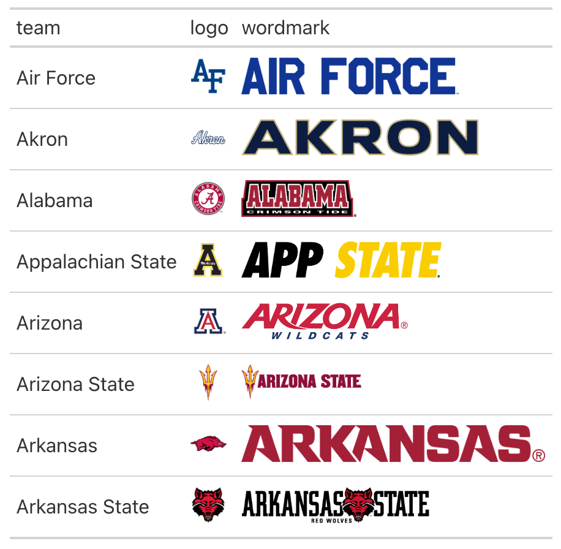
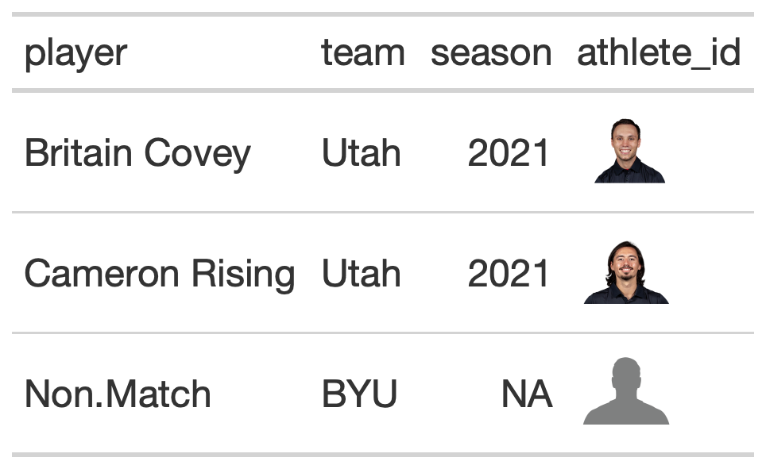

# Add logos into rows of a `gt` table

The `gt_fmt_cfb_logo` and `gt_fmt_cfb_headshot` functions take an
existing `gt_tbl` object and converts college football team names from
[`valid_team_names()`](https://cfbplotR.sportsdataverse.org/reference/valid_team_names.md)
into inline team logos or ESPN player ID's (or `headshot_url` from
`cfbfastR::cfbd_team_rosters()` function) into inline player headshots.
This is a wrapper around
[`gtExtras::gt_image_rows()`](https://jthomasmock.github.io/gtExtras/reference/gt_img_rows.html)
written by Tom Mock, which is a wrapper around
[`gt::text_transform()`](https://gt.rstudio.com/reference/text_transform.html) +
[`gt::web_image()`](https://gt.rstudio.com/reference/web_image.html)/
[`gt::local_image()`](https://gt.rstudio.com/reference/local_image.html)
with the necessary boilerplate already applied.

## Usage

``` r
gt_fmt_cfb_logo(gt_object, columns, height = 30)

gt_fmt_cfb_wordmark(gt_object, columns, height = 30)

gt_fmt_cfb_headshot(gt_object, columns, height = 30)
```

## Arguments

- gt_object:

  An existing gt table object of class `gt_tbl`

- columns:

  The columns wherein changes to cell data colors should occur.

- height:

  *Height of image*

  `scalar<numeric|integer>` // *default:* `30`

  The absolute height of the image in the table cell (in `"px"` units).
  By default, this is set to `"30px"`.

## Value

An object of class `gt_tbl`.

## Figures



## Examples

``` r
library(gt)
library(cfbplotR)

df <- data.frame(team = valid_team_names()[1:8],
                 logo = valid_team_names()[1:8],
                 wordmark = valid_team_names()[1:8])

table <- df %>%
 gt() %>%
 gt_fmt_cfb_logo(columns = "logo") %>%
 gt_fmt_cfb_wordmark(columns = "wordmark")

df <- data.frame(
 player = c("Britain Covey", "Cameron Rising","Non.Match"),
 team = c("Utah","Utah","BYU")
) %>%
 add_athlete_id_col(player)
#> ℹ No season column, using "most_recent_cfb_season()" rosters
#> ! No published cfbfastR-data roster file for season 2026
#> ℹ Rosters for 2026 are not published yet, using 2025
table_2 <- df %>%
 gt() %>%
 gt_fmt_cfb_headshot(athlete_id)
```
