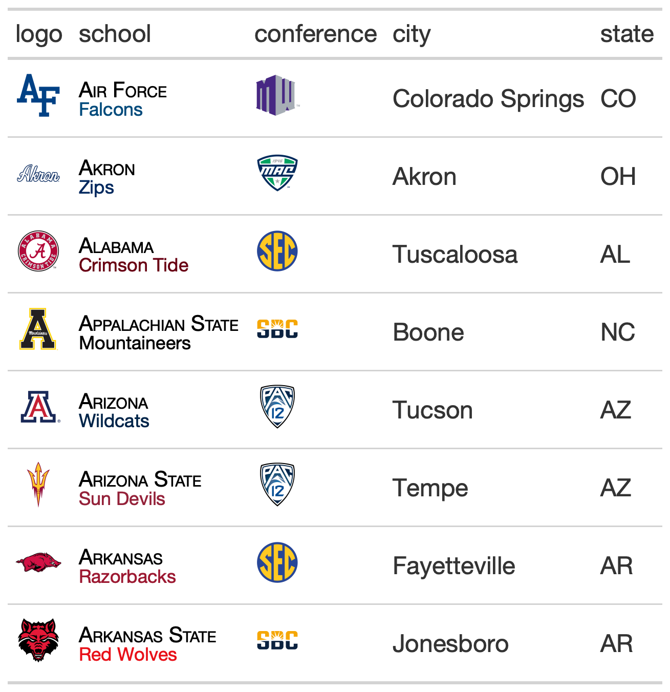

# Merge and stack text from two columns in `gt` and color one with school colors

The `gt_merge_stack_team_color()` function takes an existing `gt` table
and merges column 1 and column 2, stacking column 1's text on top of
column 2's. Top text is in all caps with black bold text, while the
lower text is smaller and colored by the team name in another column.
This is a slightly modified version of
[`gtExtras::gt_merge_stack()`](https://jthomasmock.github.io/gtExtras/reference/gt_merge_stack.html)
written by Tom Mock.

## Usage

``` r
gt_merge_stack_team_color(
  gt_object,
  col1,
  col2,
  team_col,
  font_size_top = 14,
  font_size_bottom = 12,
  color = "black"
)
```

## Arguments

- gt_object:

  An existing gt table object of class `gt_tbl`

- col1:

  The column to stack on top. Will be converted to all caps, with black
  and bold text.

- col2:

  The column to merge and place below. Will be smaller and the school
  color that corresponds to `team_col`.

- team_col:

  The column of team names that match
  [`valid_team_names()`](https://cfbplotr.sportsdataverse.org/reference/valid_team_names.md)
  for the color of the bottom.

- font_size_top:

  the font size for the top text.

- font_size_bottom:

  the font size for the bottom text.

- color:

  The color for the top text.

## Value

An object of class `gt_tbl`.

## Figures



## Examples

``` r
library(gt)
teams <-
"https://github.com/sportsdataverse/cfbfastR-data/raw/main/team_info/rds/cfb_team_info_2020.rds"
team_df <- readRDS(url(teams))

stacked_tab <- team_df %>%
  dplyr::transmute(logo = school,school,mascot,conference,city,state) %>%
  head(8) %>%
  gt::gt() %>%
  gt_merge_stack_team_color(school,mascot,school) %>%
  gt_fmt_cfb_logo(columns = c("logo","conference"))
```
